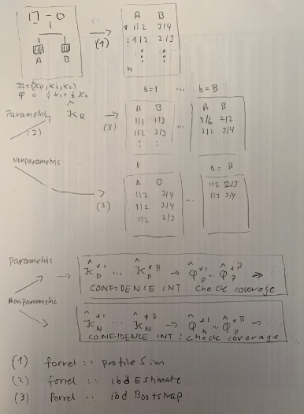

<!-- README.md is generated from README.Rmd. Please edit that file -->

```{r, echo = FALSE}
knitr::opts_chunk$set(
  collapse = TRUE,
  comment = "#>",
  fig.path = "man/figures/README-",
  cache.path = "README_cache/"
)
```


# Bootstrapping and kinship estimation

## Installation

To get the latest version, install from GitHub as follows:

```{r, eval = FALSE}
 # First install devtools if needed
if(!require(devtools)) install.packages("devtools")

# Install dvir from GitHub
devtools::install_github("thoree/kinBoot")
```

Currently the main function is `bootPhi`. The purpose of the function
is to compare parametric and nonparametric boostrapping for the kinship coefficient.
It is a wrapper for some functions of the `ped suite` of R-libraries, in particular **forrel**. The below figure (to be repaced by a proper figure)
explains the simulation experiement.



## Tutorial example

The goal of this example is to explain in detail how the simulation experiment
to evaluate and compare parametric and nonparametric bootstrap is performed.
We consider double first cousins. The IBD coefficient kappa and kinship coefficient phi
are calculated below
```{r}
library(kinBoot)
library(forrel)
library(ribd)
# library(coxed) # Only needed for coxed::bca confidence intervals
ped = doubleFirstCousins() 
ids = leaves(ped)
phi = kinship(ped, ids)
c(kappa = kappaIBD(ped, ids), phi = phi)
```
We set the 35 markers in the database `forrel::NorwegianFrequencies`
as follows:
```{r}
ped = setMarkers(ped, locusAttributes =  NorwegianFrequencies)
```

Below N = 2 simulations are done using only B = 100 bootstraps.

```{r}
res1 = bootPhi(ped, ids, N = 2, B = 100, seed = 17)
```

Excerpts of the output is discussed next starting with the parametric simulations:

```{r}
round(res1$simParametric[1:2,], 4)
```

For the first simulation, `sim1` above, marker data were generated for the double cousins
using the function `forrel::profileSim`. Kappa was estimated by `forrel::IBDestimate` and the realised value
0.2023 found. The average phi based on the B=100 bootstraps from `forrel::ibdBootstrap` is 0.1978 and the average bias is -0.0046.
The 95% confidence interval was estimated with the default percentile method using the `quantile`function.
The value of `cover` is 0 for `sim1` since this interval does not cover the kinship coefficient 0.125.
The output for the nonparametric method is obviusly conceptually similar:

```{r}
round(res1$simNonparametric[1:2,], 4)
```

Note that the `realised`value is the same as above. The values averaged over all, i.e., 2 simulations in this case,  are also reported
as shown below

```{r}
round(res1$averaged[1:2,], 4)
```

Below only
one simulation is done and IBD triangle plots are shown
with the parametric to the left:

```{r}
res1 = bootPhi(ped, ids, N = 1, B = 100, seed = 17, plot = TRUE)
```

The results from `ibdBootstrap` are returned from the last simulation.
This can be used for further plotting, for instance normality plots as next

```{r}
x = res1$bootParametric
par = 0.25*x$k1 + 0.5*x$k2
x = res1$bootNonparametric
non = 0.25*x$k1 + 0.5*x$k2
par(mfrow = c(1,2))
qqnorm(par, main = "Parametric", xlab ="", ylab ="")
qqnorm(non, main = "Nonparametric", xlab ="", ylab ="")
```

We can use boxplots or density plots to compare the distribution of
the estimates of the kinship coefficients as below:

```{r}
par(mfrow = c(1,2))
boxplot(par, non, names = c("parametric", "nonparam"),
         main = "",
         sub = "Red stapled line: theoretical value")
abline(h = res1$phi, col = 'red', lty = 2)
plot(density(par), sub = "",  lty = 1, col ="blue", 
     xlab = "kinship, parametric blue", main = "")
points(density(non),  lty = 1, cex = 0.1, col = "red")
```


